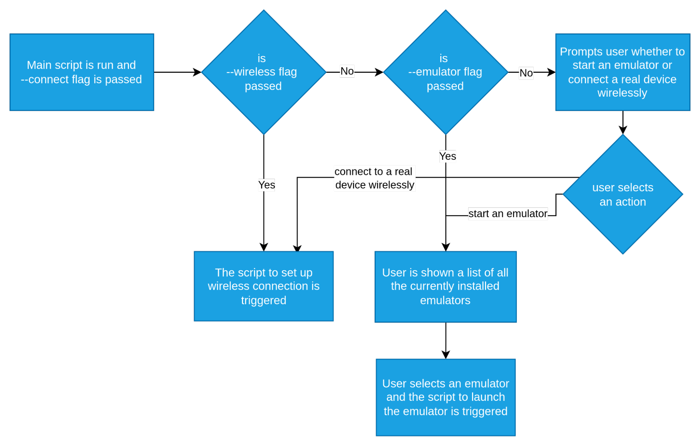

# Project Details and Specifications :dart:

> This section is about all the proposed problems, their proposed solutions and technical requirements. This section will be constantly updated until we reach down to the most optimal solution to the best of our knowledge.

## What problem are we solving?

Currently mobile-helper-tool sets up Android SDK with all the required binaries and installs emulator for pixel-5. It also installs chromedriver and firefox for the developers who wish to perform testing on the emulator.

Now we have identified some problems and proposed some use cases that we wish to implement in the tool to address the problems. These new features will improve usability of the tool and increase its reach among wider community. 

The following are the currently identified problems:

### 1. Unavailability of the ability to connect a real device wirelessly with the computer.

Users can connect their device with their computer using a USB cable. However, this can be inconvenient for some users in some circumstances. Some users might like to connect their devices wirelessly for their specific requirements. We wish to add a workflow allowing users to connect their device wirelessly without any physical connection whatsoever. This will improve accessibility of the users.

### 2. Launching AVDs and Managing multiple devices (real and emulator) is currently not possible with the current implementation of the tool.

There are a lot of possible scenarios where developers would like to connect and manage multiple devices (real and emulator). The tool currently offers no such functionality to facilitate this requirement. We plan to create a workflow such that users can connect their devices, launch multiple AVDs, view all the connected devices and disconnect any specific device they wish to. This improves the usability of the device to a great extent.

### 3. Searching the location of each binary to execute their commands is a hassle.

The SDK offers a wide range of commands that users can execute depending on their requirements. We are planning to create several workflows for the most popular SDK commands. However, creating workflows for all the use cases covering all the available commands is not practically possible in a limited time period. The tool might cover the majority of the available commands in the future but as for now an alternative approach has to be developed to avoid the hassle of searching the locations of the binaries and improving user experience.

### 4. Tool installs only a specific system images and emulator device.

The Android SDK offers a huge number of emulator devices that are not only mobile devices, but also android TVs and smart watches. There would be users/developers across the world who wish to test or try using any specific emulator depending on their requirements. The mobile-helper-tool currently sets up an emulator for pixel-5. To increase the reach and usability of the tool, we wish to add support for installing multiple emulators and corresponding system images.

### 5. Once the SDK is installed, there is no support to update the tools.

There are constant improvements in tools and technologies like upgradation of API levels, bug fixes, improvements in command line tools etc. We need to keep our tools up to date and hence this use case is very crucial. The tool currently installs the SDK and emulator but there is no support for keeping a check on the latest updates and updating anything according to our requirements.

## What are the requirements and constraints of the problem?

We can divide our requirements into three sub categories: critical, important and nice-to-have.

### Requirements

- **Cricital Requirements**
    - Ability to connect to a device wirelessly using ADB.
    - Ability to launch a specific AVD.
    - Installation of various system images.
    - Installation of various AVDs.
    - Showing a list of available AVDs and their corresponding system images.
    - Showing a list of available updates for SDK tools and installing any update.

- **Important Requirements**
    - Showing a list of all the connected devices.
    - Ability to disconnect a connected device.
    - Ability to shut down an AVD.
    - Ability to run various binaries from the tool itself.
    - Showing a list of all the installed system images.
    - Ability to uninstall system images and emulators.

- **Nice to have Requirements**
    - Ability to disconnect all the connected devices.
    - Ability to update all SDK tools at once.

### Constraints

- ADB wireless connection with pairing code is available only with android version 11 (API level 30) or higher.

    > We don't need to support the devices below that, atleast through automation. *~comment from @garg3133*

- There are stages when the terminal gets updated with new logs after a command is run (eg. `./emulator -avd nightwatch-android-11` shows new logs when we do something with the emulator). It will be difficult to show those logs when running the commands from the tool.

    > we can push those logs into a separate file if the user asks for it by passing an appropriate flag, like `--log_dump <filename>`. *~comment from @garg3133*

## What are the possible solutions for solving these problems?

### Iteration 1

Users will have access to the following subcommands:

- connnect
- disconnect
- install
- uninstall

When using these subcommands with their specific flags will trigger their corresponding workflows as described below:

- Workflow 1 

    This workflow is about connecting a real device with the computer wirelessly, launching an AVD and showing a list of all the connected devices. To follow this workflow, users will pass the `connect` subcommand along with:
    
    - `--wireless` flag which will trigger the script to setup wireless connection with the real device.

    - `--avd` flag which will trigger the script to launch the AVD. At first, a list of all the available AVDs will be shown to the user. Upon selecting an option, the selected AVD will be launched.

    - `--show` flag which will display a list of all the connected devices.

    ```bash
    # to connect with real device
    npx @nightwatch/mobile-helper android connect --wireless

    # to launch an AVD
    npx @nightwatch/mobile-helper android connect --avd

    # to show all the connected devices
    npx @nightwatch/mobile-helper android connect --show
    ```

- Workflow 2

    This workflow is for disconnecting a device. For this workflow, users will pass the `disconnect` subcommand. A list of all the currently connected devices (both real and AVDs) will be shown along with a *disconnect all* option. Upon selecting an option, the specific device will be disconnected (*disconnect all* will disconnect all the connected devices).

    ```bash
    # to disconnect a device
    npx @nightwatch/mobile-helper android disconnect
    ```

- Workflow 3

    This workflow is for installing system images, creating AVDs and installing APKs. It will cover the usage of `install` subcommand along with:

    - `--system-image` flag which will show a list of available system images to install. Upon selecting a system image, the installation script will be triggered.

    - `--avd` flag which will show a list of currently installed system images. Upong selecting a system image, a list of android devices will be shown from which user can select a device to create AVD with the selected system image.

    - `--app` flag which prompt users to enter the path to the APK they wish to install in AVD or real device. Upon entering the path, a list of all the connected devices will be shown. User will select an option and APK installation in that device will begin.

    ```bash
    # to install a system image
    npx @nightwatch/mobile-helper android install --system-image

    # to create an AVD
    npx @nightwatch/mobile-helper android install --avd

    # to install an APK in a device
    npx @nightwatch/mobile-helper android install --app
    ```

- Workflow 4

    This workflow is for uninstalling a system image and AVD. It will cover the usage of `uninstall` subcommand along with:

    - `--system-image` flag which will show a list of currently installed system images along with all the AVDs used by each system image. Upon selecting an option, the specific system image will be uninstalled. If a system image being used by any existing AVD is deleted, then a warning will be shown and the AVD will also be deleted.

    - `--avd` flag which will show a list of all the currently installed AVDs. Upon selecting an option, the specific AVD will be deleted.

    ```bash
    # to uninstall a system image
    npx @nightwatch/mobile-helper android uninstall --system-image

    # to delete an AVD
    npx @nightwatch/mobile-helper android uninstall --avd
    ```

- Workflow 5

    - Users can use the `--update` flag to check a list of all the available updates provided by the SDK manager.

    - Users can either choose any specific update or just select the **update all** option to install all the available updates.

    ```bash
    # to update the SDK tools
    npx @nightwatch/mobile-helper android --update
    ```

- Workflow 6

    - Users can use nightwatch's centralized CLI for running any of the installed binaries.

    - Results genereted by the binaries will shown in the nightwatch CLI itself.

        > *As earlier discussed, this appears a more optimal and natural approach to me. Allowing users to run the commands from the same nightwatch CLI is better way of solving this problem then trying to set up the `PATH` variable or do something else. This approach is easy and straightforward from user point of view as well.*

### Iteration 2

- Ideas on how documentation can be improved from users' POV.
    
    - **Providing troubleshooting steps:** A lot of users find difficulty when something breaks while running any command from the tool. Since mobile-helper is an automation tool, most errors can be resolved by running commands manually. We should provide the steps for manually performing a process. This will come to great use and will save a lot of time for users stuck with errors.

    - **Visual Aids:** We can create flow charts showing the entire process of a workflow. For eg:
    
    
        > The above shown image is just an example and doesn't represent any proposed flow for the tool.

    - **Making imporvements with user feedback:** From the discord community forum, we can see how users are interacting with our tool, what difficulties they are facing and how much is our documentation helpful to them. We can iteratively add improvements to the documentation.

- Ideas on how certain parts of documentation can be made more accessible to the users.

    - **Inline documentation and CLI usage instructions:** Providing important details directly inside the source code can make it more accessible for users. Some important details can also be highlighted along with the CLI usage instructions.

    - **Searchable documentation:** Since Nightwatchjs already has its website with optimized search capabilities, we can expose our documentation there to make it more accessible.

## Implementation

The implementation can be broken into there parts:
    
- Writing scripts for automating the SDK workflows.

- Creating commands for users to trigger the mobile-helper workflows.

- Building the integration (mobile-helper workflow) between the user input command and the final automation script.

The following are the SDK commands according to their priority for this project:

- Cricital Commands

    ```bash
    # to pair and connect a real device
    adb pair <device-ip>:<pairing-port> <pairing-code>

    adb connect <device-ip>:<port>

    # to launch an emulator
    emulator -avd <name-of-emulator>

    # to list all the SDK tools and system images available for download
    sdkmanager --list

    # to install the SDK tools and system images
    sdkmanager <name-of-package>

    # to list all the available devices
    avdmanager list devices

    # to list all the installed AVDs
    avdmanager list avd

    # to create the AVD
    avdmanager create avd --name <name-of-avd> --package <system-image> --device <name-of-device>

    # to list available updates
    sdkmanager --list --include_obsolete

    # to update a package
    sdkmanager <name-of-package>
    ```

- Important Commands

    ```bash
    # to list all the currently running devices
    adb devices

    # to disconnect a real device
    adb disconnect <device-id>

    # to stop an emulator
    adb -s <emulator-id> emu kill

    # to delete an AVD
    avdmanager delete avd --name <name-of-avd>

    # to uninstall a SDK tool or system image
    sdkmanager --uninstall <name-of-package>
    ```

- Nice to have Commands

    ```bash
    # to update all the packages
    sdkmanager --update

    # to stop all the AVDs and disconnect all the devices
    adb kill-server
    ```

The following steps will be encountered with the execution of the mobile-helper workflow:

- `AndroidSetup` class instance is created and the main `run()` function is called.

- Environment is verified. The steps include:
    - Checking Java installation
    - Checking the presence of `ANDROID_HOME` and `JAVA_HOME` in `process.env` and loading other environment variables to `process.env`

- After checking the environment, the control flow diverges from the main script and shifts to the execution of the desired SDK script.
